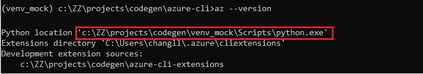

# What's a Virtual Server 
The Virtual Server just works as if it’s a real Azure Resource Management Site. It supports all management APIs that defined in the azure-rest-api-specs repo (or any subset of it). It can serve invokes from any AzureCLI/Terraform/SDKs/Postman... with below capabilities:

1. check the request schema.
2. mock a response to client.

## Azure CLI under a Virtual Server
Any management Azure CLI command works with Virtual Server, below is a sample:

# Virtual Server Behaviour
You can run the Virtual Server at any computer. After starting up, it listens on below endpoint by default:
+ https://0.0.0.0:8441, stateful.
+ http://0.0.0.0:8442, stateless http.
+ https://0.0.0.0:8443, stateless https.
+ https://0.0.0.0:8445, always return 500 to simulate service internal error (except resourcegroup operations).

Since currently the HTTPS certificate is created with domain localhost, so the HTTTPS endpoints can only be visited though "localhost".

> **_NOTE:_** If these listening ports are already been used by other apps in your computer, change listen ports in [src/main.ts](./src/main.ts).

## What's stateful/stateless
Stateful: 
+ Client could only call GET/DELETE after CREATE succeeded, otherwise it will get the response code of 404.
+ Client can only create sub resource if parent has already exist. For instance: should create resourceGroup-->virtual network-->subnet in sequence order.

Stateless:
+ Every GET/List will get a valid mocked response.

# Getting Started (with Azure CLI)
## Prerequisites
+ The Azure CLI is well installed. (https://docs.microsoft.com/en-us/cli/azure/install-azure-cli)
+ The Nodejs is well installed. (https://nodejs.org/en/download/)
## Step 1: Start a Virtual Server
Please make sure nodejs is well installed in your computer before start.
### 1.1 Clone this project into the same local folder with azure-rest-api-specs.
The swagger repo is a companion repo of avs. They can be cloned to local with below commands:
~~~ shell
# cd MY_WORKSPACE
# git clone git@github.com:Azure/azure-rest-api-specs.git
# git clone devdiv@vs-ssh.visualstudio.com:v3/devdiv/DevDiv/avs
~~~

The workspace folder is like below after above git clones succeeded:
~~~
+-- MY_WORKSPACE
|   +-- azure-rest-api-specs    // swagger repo
|   +-- avs                     // this repo
~~~

### 1.2 download *.pem files for self-signed certificate.
~~~ shell
# az login ...      // login azure cli with your credential
# cd avs
# . ./initiate.sh   // for LINUX or mac
~~~
or
~~~ bat
> .\initiate.ps1    // for Windows, need to run in powershell
~~~
If failed for permission reasons, please contact [CodeGen Core team vsccodegen@microsoft.com](vsccodegen@microsoft.com) for authentication on keyvault used in the scripts. Or you may create self-signed key&cert by your self, the required files can be found in [src/webserver/httpServerConstructor.ts](./src/webserver/httpServerConstructor.ts)  

### 1.3 start up Virtual Server
~~~
# npm install && npm run start
~~~
Common trouble shootings for starting the web server:
+ make sure ports used in avs aren't already been used by other process.
+ try to used sudo/"start as administrator" if failed to start listening.

It takes up to two minutes to load all swagger files in the azure-rest-api-specs repo after the virtual server started. 
So please use it (for instance by Postman) after "validator initialized" is shown in the console.

## Step 2: Azure CLI Configuration
After the virtual server is started in local computer, below section describe how to consumes the virtual server in client side. 

### 2.1 Activate the Python Environment
Run `'az --version'` to get which python environment is used in your computer, for instance:

According to above output, you know the CLI is using Python virtual environment c:\ZZ\projects\codegen\venv_mock, saying it's YOUR_VENV.
Then you need to activate this venv:
~~~
# . <YOUR_VENV>/bin/activate       // for LINUX/mac
or
> <YOUR_VENV>\Scripts\activate    // for Windows
~~~
> **_NOTE:_**  If your Azure CLI is installed with no python virtual environment (a system Python or a CLI embeded Python), don't need to activate any VENV, but make sure the step 2.2 will be executed with that Python folder.

### 2.2 Trust Virtual Server certificate in Python environment
The Virtual Server is using a self-signed certificate, so need to trust it by appending it to file cacert.pem in your Python environment.
~~~ shell
# cat .ssh/localhost-ca.crt >> <YOUR_VENV>/lib/python3.8/site-packages/certifi/cacert.pem       // for LINUX/mac
~~~
or
~~~ bat
> type .ssh\localhost-ca.crt >> <YOUR_VENV>\Lib\site-packages\certifi\cacert.pem    // for Windows
~~~

### 2.3 Ask Azure CLI to use local Virtual Server
~~~ shell
# az login --server-principal --username <USERNAME> --password <PASSWORD> --tenant <TENANT> // login with any realworld credential
# az cloud register -n virtualCloud 
                    --endpoint-resource-manager "https://localhost:8443"                    // connect to stateless endpoint
                    --endpoint-active-directory https://login.microsoftonline.com 
                    --endpoint-active-directory-graph-resource-id https://graph.windows.net/ 
                    --endpoint-active-directory-resource-id https://management.core.windows.net/
# az cloud set -n virtualCloud
~~~

### 2.4 Verification
Now you can try any Azure CLI command, the setup is done if mocked response is received for below command.
Feel free to try other commands.
~~~ shell
# az network vnet peering create --allow-vnet-access --name MyVnet1ToMyVnet2 --remote-vnet MyVnet2Id --resource-group MyResourceGroup --vnet-name MyVnet1

{
  "allowForwardedTraffic": true,
  "allowGatewayTransit": true,
  "allowVirtualNetworkAccess": true,
  "etag": "aaaaaaaaaaaaaaaaaaa",
  "id": "aaaa",
  "name": "MyVnet1ToMyVnet2",
  "peeringState": "Initiated",
  "provisioningState": "Succeeded",
  "remoteAddressSpace": {
    "addressPrefixes": [
      "aaaaaaaaaaaaaaaaaaaaa"
    ]
  },
  "remoteBgpCommunities": {
    "regionalCommunity": "aaaaaaaaaaaaaaaaaaaaaa",
    "virtualNetworkCommunity": "aaaaaaaaaaaaa"
  },
  "remoteVirtualNetwork": {
    "id": "aaaaaaaaaaaaaaaaaaaaaaaaaaaaa"
  },
  "type": "aaaaaaaaaaaaaaaaaaaaaaaaaaaa",
  "useRemoteGateways": true
}
~~~

## Step 3: Generate your extension with autorest.az
> **_NOTE:_** The [autorest](https://www.npmjs.com/package/autorest) is required for this step.

Following the [Autorest.az Guide](https://github.com/Azure/autorest.az#how-to-use-azure-cli-code-generator) you can generate CLI extension with your own swagger files. Key steps are:
~~~ diff
# autorest  --az 
            --use=https://trenton.blob.core.windows.net/trenton/autorest-az-1.7.3.tgz
            <path-to-the-swagger-readme.md> 
            --azure-cli-extension-folder=<output-folder>
+           --gen-cmd-test               // remember to add this option if want to run cmdlet tests (in Step 4)
# cd <output-folder>/<extension-folder>
# python setup.py sdist bdist_wheel         // generate wheel-file (*.whl) in "dist" folder
# az extension add --source=<path-to-the-wheel-file>
~~~
Now you can try to look through and run your extended Azure CLI command.
~~~ shell
# az <extension-name>  --help               // check generated comand groups
# az <extension-name> <group-name> --help  // check commands in the group
# az <extension-name> <group-name> <create|list|show|delete...> --help  // check detail command information
# az <extension-name> <group-name> <create|list|show|delete...> <--params...>  // run your command with Virtual Server
~~~

Below is sample steps for generate CLI extension for RP [guestconfiguration](https://github.com/Azure/azure-rest-api-specs/tree/master/specification/guestconfiguration/resource-manager):
~~~ bat
> autorest  --az 
            --use=https://trenton.blob.core.windows.net/trenton/autorest-az-1.7.3.tgz
            ..\azure-rest-api-specs\specification\guestconfiguration\resource-manager\readme.md
            --azure-cli-extension-folder=..\generated
            --gen-cmd-test
# cd ..\generated                     // go to the output folder
# cd src\guestconfig                  // go to the generated extension folder       
# python setup.py sdist bdist_wheel
# az extension remove guestconfig     // remove it first since it's an existing extension
# az extension add --source=.\dist\guestconfig-0.1.0-py3-none-any.whl

# az guestconfig --help               // check information for the guestconfig extension.
...
~~~
> **_NOTE:_** The variable <extension-name> can be find in readme.az.md. For guestconfiguration, it's ["extensions: guestconfig"](https://github.com/Azure/azure-rest-api-specs/blob/master/specification/guestconfiguration/resource-manager/readme.az.md#az)

## Step 4: Test generated cmdlets in one command
Testcases are also generated for the CLI extension, you can run the end-to-end test case with virtual server in one command.
The test file is located at `<output-folder>\src\<extension-name>\azext_<extension-name>\tests\cmdlet\test_positive.py`
Taking RP guestconfiguration as example, the test can be run with below command:
~~~ bat
> pip install pytest        // make sure pytest is installed
> pytest -rA <output-folder>\src\guestconfig\azext_guestconfig\tests\cmdlet\test_positive.py
...
========================= short test summary info ==========================
PASSED ..\azure-cli-extensions\src\guestconfig\...::test_guest_configuration_assignment_list
PASSED ..\azure-cli-extensions\src\guestconfig\...::test_guest_configuration_assignment_report_list
PASSED ..\azure-cli-extensions\src\guestconfig\...::test_guest_configuration_assignment_report_show
PASSED ..\azure-cli-extensions\src\guestconfig\...::test_guest_configuration_assignment_show
PASSED ..\azure-cli-extensions\src\guestconfig\...::test_guest_configuration_hcrp
PASSED ..\azure-cli-extensions\src\guestconfig\...::test_guest_configuration_hcrp2
PASSED ..\azure-cli-extensions\src\guestconfig\...::test_guest_configuration_hcrp_assignment_list
PASSED ..\azure-cli-extensions\src\guestconfig\...::test_guest_configuration_hcrp_assignment_show
========================= 8 passed, 3 warnings in 36.24s =========================
~~~
